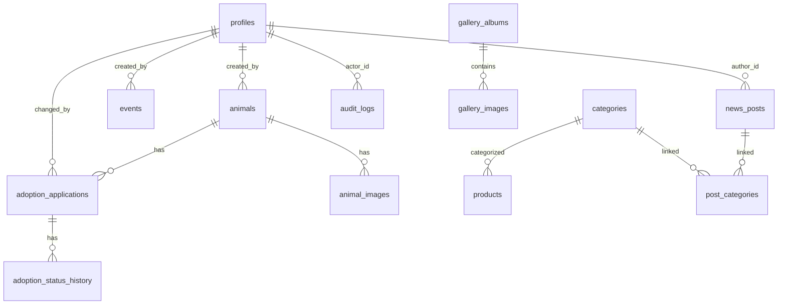

# Banco de Dados

## Tecnologia
PostgreSQL gerenciado pelo Supabase.

## Diagrama ER (Mermaid)

## Tabelas

### profiles
| Coluna | Tipo | Descrição |
|--------|------|-----------|
| id | UUID PK FK → auth.users | Identificador único |
| full_name | TEXT | Nome completo |
| role | TEXT (admin/superadmin) | Papel no sistema |
| active | BOOLEAN | Se está ativo |
| created_at | TIMESTAMPTZ | Data de criação |
| updated_at | TIMESTAMPTZ | Data de atualização |

### animals
| Coluna | Tipo | Descrição |
|--------|------|-----------|
| id | UUID PK | Identificador único |
| name | TEXT | Nome do animal |
| slug | TEXT UNIQUE | Slug para URL |
| species | TEXT | dog/cat/other |
| sex | TEXT | male/female |
| size | TEXT | small/medium/large |
| birth_date_estimate | DATE | Data de nascimento estimada |
| age_text | TEXT | Texto livre para idade |
| description | TEXT | Descrição |
| status | TEXT | available/adopted/in_process/archived |
| featured | BOOLEAN | Destaque na home |
| published | BOOLEAN | Publicado |
| deleted_at | TIMESTAMPTZ | Exclusão lógica |

## Row Level Security

### Funções auxiliares
- `public.is_admin()` - Verifica se auth.uid() tem papel admin ou superadmin
- `public.is_superadmin()` - Verifica se auth.uid() tem papel superadmin

### Políticas por tabela
Todas as tabelas seguem o padrão:
- **SELECT**: Público para dados publicados; admin/superadmin para dados internos
- **INSERT**: Público para formulários; admin/superadmin para conteúdo
- **UPDATE**: Admin/superadmin apenas
- **DELETE**: Admin/superadmin apenas (ou soft delete)

## Storage

### Buckets
- `animals` - Imagens dos animais
- `events` - Imagens de eventos
- `products` - Imagens de produtos
- `gallery` - Imagens da galeria
- `news` - Imagens de notícias

### Políticas
- Leitura pública para arquivos publicados
- Upload/update/delete apenas para admin/superadmin
- Tipos permitidos: image/webp, image/jpeg, image/png
- Limite: 5MB por arquivo
